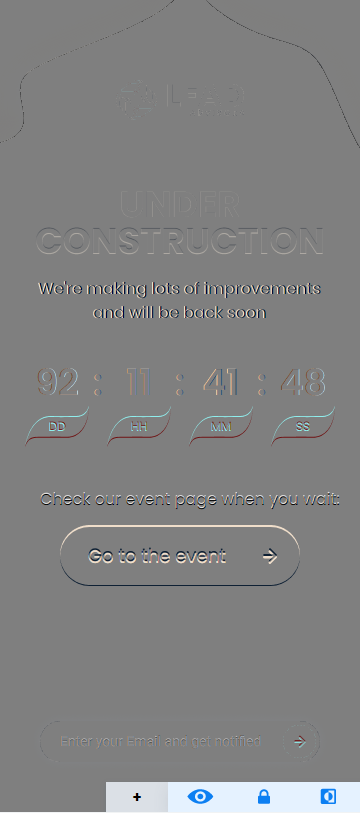
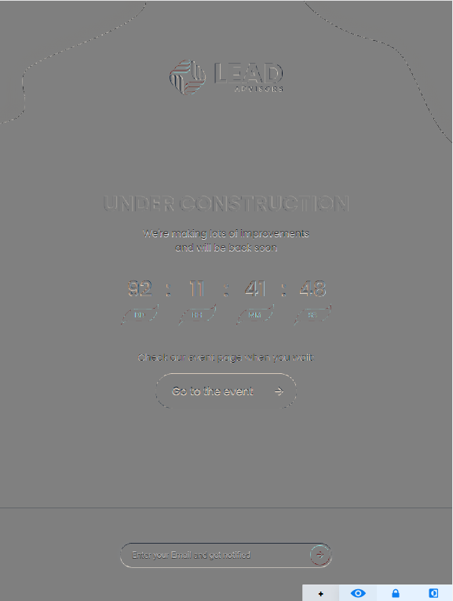
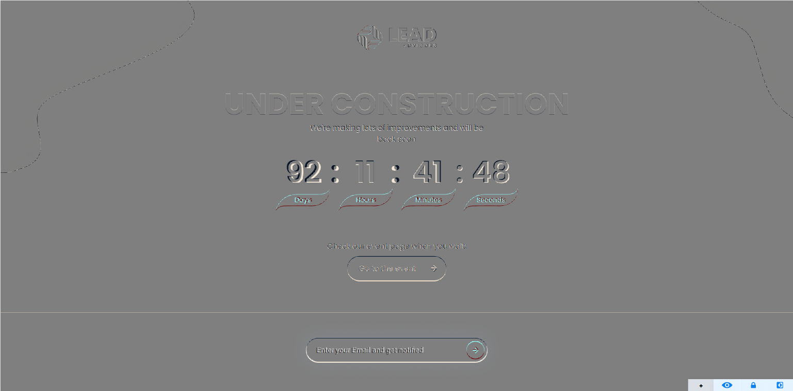

## Таймер

### Описание проекта  
Проект представляет собой веб-страницу с таймером, который ведет отсчет времени до определенной разработчиком даты.  
Пользователь может перейти на сторонний сайт кликнув по кнопке "Go to the event" или заново открыть эту страницу, нажав на логотип в верху окна.
Также имеется возможность отправить  Email (он попадет на сервер с учебными API), после чего появится popup c уведомлением.  
[Деплой](https://ecstatic-liskov-62461d.netlify.app)  
[Макет](https://www.figma.com/file/d5IdsQyRJf6W7YDTgJqUky/EA-Test-Front-End?node-id=0%3A1)  

### Технологии  
* HTML,  
* SASS/CSS,  
* JS,  
* Webpack 5  
### Pixel Perfect:
  
  
  
